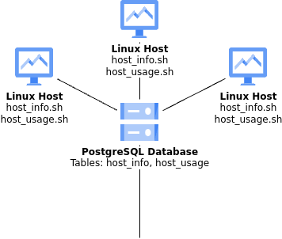

# Introduction
This project is designed to collect and store hardware specifications and usage data from Linux machines in a 
centralized PostgreSQL database. The system consists of Linux agents running scripts that gather data and insert it 
into the database for analysis. The project enables system administrators and developers to monitor, analyze, and 
report on hardware resources such as CPU usage, memory consumption, and disk I/O performance across multiple Linux 
hosts. It helps optimize system performance and resource allocation by capturing real-time and historical data.

Technologies used in this project include Bash for scripting, Docker for containerizing the PostgreSQL database, Git 
for version control, PostgreSQL for data storage, and Crontab for scheduling periodic data collection. 


# Quick Start
The following commands can be used to ensure the successful implementation of the project:

- Start a PostgreSQL instance using psql_docker.sh
```bash
./scripts/psql_docker.sh start
```
- Create the necessary tables using ddl.sql
```bash
psql -h localhost -U postgres -d host_agent -f sql/ddl.sql
```
- Insert hardware specification data into the database using host_info.sh
```bash
./scripts/host_info.sh localhost 5432 host_agent postgres password
```
- Insert hardware usage data into the database using host_usage.sh
```bash
./scripts/host_usage.sh localhost 5432 host_agent postgres password
```
- Set up a crontab to run host_usage.sh every minute
```bash
crontab -e
* * * * * /path/to/host_usage.sh localhost 5432 host_agent postgres password 
```


# Implemenation

## Architecture


## Scripts
### psql_docker.sh 
- starts, stops, and initializes the PostgreSQL container using Docker
```bash
./scripts/psql_docker.sh start|stop|create
```
### host_info.sh 
- collects hardware specifications and stores them into the "host_info" table
```bash
./scripts/host_info.sh psql_host psql_port db_name psql_user psql_password
```
### host_usage.sh 
- collects current hardware usage data and stores it into the "host_usage" table
```bash
./scripts/host_usage.sh psql_host psql_port db_name psql_user psql_password
```
### crontab 
- used to schedule host_usage.sh to run every minute to continuously collect data

## Database Modeling
### host_info
| Column           | Type      | Description                    |
|------------------|-----------|--------------------------------|
| id               | SERIAL    | Unique identifier for the host |
| hostname         | VARCHAR   | Hostname of the Linux machine  |
| cpu_number       | INT2      | Number of CPU cores            |
| cpu_architecture | VARCHAR   | CPU architecture               |
| cpu_model        | VARCHAR   | CPU model                      |
| cpu_mhz          | FLOAT8    | CPU speed in MHz               |
| l2_cache         | INT4      | L2 Cache size in KB            |
| timestamp        | TIMESTAMP | Timestamp of data collection   |
| total_mem        | INT4      | Total Memory in MB             |
### host_usage
| Column           | Data Type   | Description                    |
|------------------|-------------|--------------------------------|
| timestamp        | TIMESTAMP   | Timestamp of data collection   |
| host_id          | SERIAL      | Unique identifier for the host |
| memory_free      | INT4        | Available memory in MB         |
| cpu_idle         | INT2        | Percentage of CPU idle         |
| cpu_kernel       | INT2        | CPU usage of kernel            |
| disk_io          | INT4        | Disk I/O operations            |
| disk_available   | INT4        | Available disk space in MB     |


# Testing
The bash scripts were tested by manually running and verifying that data was successfully inserted into the PostgreSQL 
database. Queries were run to check the validity of the data and ensure it matched the expected output from the Linux 
lscpu and vmstat commands.


# Deployment
The app was developed and deployed using GitHub for version control and collaboration, Docker for containerizing the PostgreSQL 
database, and Crontab for scheduling scripts for data collection. The entire setup was automated to ensure seamless 
deployment across different environments.


# Improvements / Additions
- Implement a mechanism to detect and update hardware changes automatically (ie. changes to CPU, Memory, etc.)
- Add monitoring and alerting features to notify users of current critical hardware resource limits
- Optimize data collection intervals based on system usage/activity
